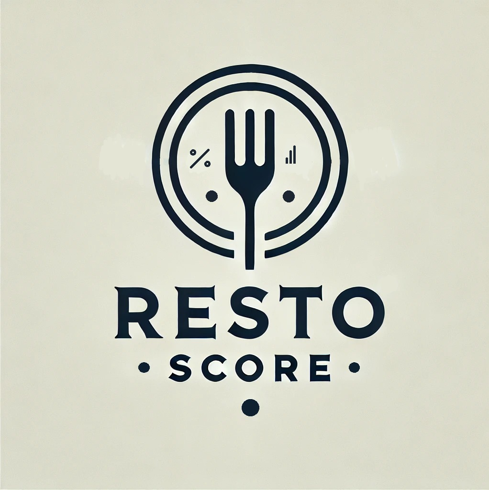

# Presentación Proyecto Grupal Henry - Data Science 2025 - Grupo 03 

## **<u> Comprensión de la situación actual </u>**:

### **Contexto** 
En la era digital, la percepción y reputación de los negocios dependen en gran medida de las reseñas y calificaciones de los usuarios. Esto es especialmente relevante para la industria de servicios de restaurantes donde influye directamente en la toma de decisiones de nuevos consumidores y potencialmente en la rentabilidad de los negocios.  
Para una empresa con un capital significativo interesada en invertir en el mercado estadounidense por motivos estratégicos que no nos ha querido revelar, nos ha indicado que relevemos y analicemos la situación de la industria en el país, para proveerle posibles puntos estratégicos de inversión, que logremos entender el sentimiento de las personas respecto a estos locales  y que en definitiva, brindemos a los usuarios un sistema de recomendación que se retroalimente de sus reseñas en línea.

### **Análisis** 
Nos enfocamos en utilizar datos de la macroeconomía para conocer los Estados más relevantes y, una vez obtenidos, comenzar con los análisis respectivos de los restaurantes y consumidores respecto a estos.
*	Identificar estados con potencial en base a factores económicos y demográficos.
*	Medir la valoración general de la industria de restaurantes en los Estados objetivo a través del análisis de sentimientos.
*	Desarrollar un sistema de recomendación que ayude a los restaurantes a mejorar su servicio y atraer clientes mediante retroalimentación.

### **Posibles Soluciones**
Para abordar esta problemática, el proyecto se desarrollará en varias fases, permitirá a la empresa contratante tomar decisiones informadas sobre la industria de restaurantes en EE.UU., asegurando una estrategia basada en datos confiables. La combinación de análisis de sentimientos, predicción de tendencias y optimización geográfica garantizará un impacto positivo en la industria y el crecimiento del negocio en mercados clave.

## **<u>Objetivos</u>**:

1.	Recolectar y almacenar datos: Se consolidará información de Google Maps, Yelp y fuentes macroeconómicas públicas de EE.UU. Se explorarán bases de datos como data.gov y Bureau of Labor Statistics para obtener información sobre ingresos estatales, empleabilidad y tendencias económicas.
2.	Analizar de forma Exploratoria los Datos (EDA): Se evaluará la calidad y estructura de los datos para detectar patrones relevantes. Se incluirá información sobre los tipos de empleados en la industria de restaurantes, lo que permitirá generar insights adicionales sobre el mercado laboral.
3.	Identificar estados más apropiados para invertir: Se analizarán variables como población, ingresos y comportamiento del consumidor para reducir la selección a 5 estados clave. 
4.	Crear un dashboard interactivo: para visualizar los resultados de análisis y predicciones que faciliten la toma de decisiones, incluyendo KPIs para medir el rendimiento del local y de la industria.
5.	Desarrollar un sistema de recomendación: entrenar un modelo de Machine Learning para predecir tendencias de los clientes y conocer los atributos más demandados por los consumidores

## **<u> Alcance</u>**
El proyecto se desarrollará sobre la información provista de Google Maps y YELD, a la cual se sumarán datos Macroeconómicos de acceso público de los Estados Unidos para evaluar variables como Población, Ingresos, Rangos Etarios, Situación Laboral, que permitirán escoger los estados con mejores perspectivas y/o tendencias para llevar a cabo una inversión en el rubro de servicios de restaurante. Una vez escogidos los 5 mejores estados, se procederá a utilizar la información base para su EDA correspondiente. Consideramos importante utilizar la mayor cantidad de información disponible para que nuestro análisis tenga fundamentos sólidos. 
Finalizado el EDA, podremos avanzar hacia la confección de un Dashboard con el estado elegido como el mejor para formalizar la inversión, a su vez se implementará la conexión con el DW alojado en Google Cloud Storage y la posible automatización del proceso incremental de carga de datos . 
Lograda la implementación del DW y el proceso de automatización, se conectará el Dashboard para que extraiga los datos y dar por finalizado el proceso ETL. 
El algoritmo se entrenará con una porción de los datos del estado seleccionado y se compararán sus resultados con el grupo de control para conocer si su resultado es deseado. 
Consideramos que podría utilizarse mayor cantidad de datos para entrenar el algoritmo, pero que esto nos demandaría demasiado tiempo, recursos y quizá dinero para lograr un despliegue más rápido en la nube. 
El alcance podría ser mayor si se considerarán los datos relativos a las ubicaciones puntuales dentro de cada Estado, intentaremos definir áreas geográficas específicas mediante el Dashboard.

## **<u>Objetivos y KPIs asociados </u>**

*   **Lograr una tasa de reseñas positivas superior al promedio de la industria en el mismo estado en los primeros 6 meses.**  
 Tasa reseñas positivas = (Reseñas ≥ 4 estrellas / Total de reseñas) × 100

*   **Generar un puntaje de sentimiento promedio superior o igual a 4 (en una escala de 1-5 estrellas) en los primeros 6 meses**  

*   **Lograr un crecimiento mensual de reseñas del 5% al 10% en los primeros 6 meses.**  
 Crecimiento mensual de reseñas = ((Reseñas mes actual - Reseñas mes anterior) /  Reseñas mes anterior) × 100

**Repositorio GitHub**: https://github.com/JamesRaynor007/ProyectoGrupalHenry
 

## **<u>Solución propuesta</u>**
Nuestra metodología de trabajo se basa en un trabajo de investigación de fuentes de información para elaborar análisis basados en indicadores macroeconómicos, utilizando EDA sobre los datos al tiempo que cruzamos información con las fuentes dadas. Desarrollamos un datalake en la nube para almacenar todos los datos y creamos tablas en Google Query para alimentar nuestro Dashboard. 
El algoritmo de Machine Learning se alimentará de los datos limpios y procesados que se almacenarán en el datalake, separados de los datos crudos. 
Nos organizamos en equipos de trabajo para dividir nuestra tareas. 
En ingeniería de datos Richard y Verónica, en documentación y analítica de datos Isabela y Tomás, Alejandro intentando ser un team lead para coordinar y apoyar todas las tareas de EDA, ETL y ML. 
De nuestro trabajo surgirán en una primer etapa, un EDA completo de los datos analizados, el flujo de trabajo esperado a desarrollarse a lo largo del proyecto junto con el stack tecnológico propuesto para implementar. 
En segunda instancia, produciremos un DL que almacenará los datos en Google Cloud Storage y generaremos archivos Python para correr en Google Cloud Run y llevar esos datos crudos del DL hacia Google Power Query, almacenándolos de forma estructurada. En esta etapa completaremos el proceso ETL, automatizando la carga incremental. 
Finalmente, nuestro entregable final será un Api de recomendación, para implementarse en la web y un Dashboard interactivo que se alimentará de los datos limpios y procesados de Google Query.
